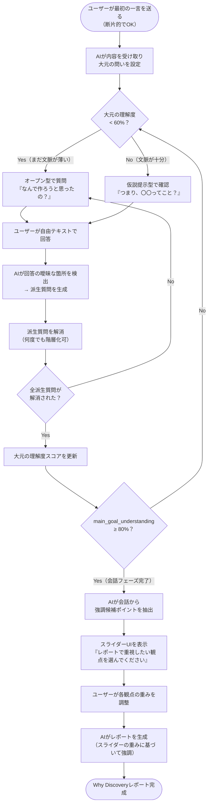

# PRD — Why Discovery Engine（仮称: CLARIX）

**Version 1.0 | 2026-02-19**

---

## 0. エグゼクティブサマリー

> 「言葉にならない想いを持つ人が、AIに一言送るだけで、自分でも気づいていなかった真のWhyを発見できる」

本プロダクトは、人間が無意識に行う **ベイズ的推論による課題解像度向上プロセス** をAIに実装した、世界初の「Whyに特化した壁打ちエンジン」である。

---

## 1. Why（なぜ作るのか）

### 1.1 問題の構造

人間は会話において **約60%の不完全な情報** で相互理解を行う（Zipf則：20%の言語表現が80%の意味を担う）。熟練者はこの空白を **ドメイン知識という事前確率 P(Goal)** で補完し、不明点を的を絞った質問で補完する。

しかし、この能力は：
- 属人化している（熟練者に依存）
- スケールしない（1対1の対話が前提）
- 言語化が苦手な人への配慮が欠如している

### 1.2 解決すべき本質

人間が無意識に行う「先輩と後輩の壁打ち」のプロセスには、AIが再現できていない **2つの構造** がある。

#### 構造1: 「大元の問い」と「派生質問」の独立した階層管理

人間の先輩は、相談を受けたとき **2つの軸を同時に追う**：

| 軸 | 内容 | 状態例 |
|----|------|--------|
| **大元の理解度** | なぜそれを作りたいのか？ | 最初はゼロ |
| **現在の派生質問の解像度** | 今この回答の何が曖昧か？ | 逐次更新 |

先輩はこの2軸それぞれを **独立してスコア管理** しながら会話を進める。
派生質問が解消されて初めて「大元の理解度」が上昇し、次の問いに移る。

#### 構造2: 理解度に連動した質問スタイルの切り替え

先輩は「相手のことをどれだけ理解しているか」で、質問の仕方を自動的に変える：

```
大元の理解度 < 閾値（暫定60%）の場合
  → オープン型: 「それってどういうこと？」「具体的には？」
    ※ まだ仮説を立てる前提知識が不足しているため

大元の理解度 ≥ 閾値の場合
  → 仮説提示型: 「つまり、〇〇ってこと？」「こういうことをイメージしてる？」
    ※ 十分な文脈を持つため、自分の解釈を提示して確認できる
```

この閾値は学術的根拠（後述）に基づき設定し、実運用でチューニングする。

#### なぜ現在の生成AIはこれができないか

```
現在の生成AI:
  ユーザー「壁打ちAIを作りたい」
     ↓
  「技術的なボトルネックですか？組織の問題ですか？自分の思考整理ですか？」
        ↑ 問題: 大元の理解度がゼロの状態で仮説を出している
              → 仮説の根拠がなく「まとめすぎた解釈」になる
              → ユーザーは「なんか違う」と感じるが説明できない

CLARIX（目指す姿）:
  ユーザー「壁打ちAIを作りたい」
     ↓
  [大元の理解度: 0%] → オープン型で問う
  「なんで作ろうと思ったの？」
     ↓
  ユーザー「ドメイン知識がないと要件定義を読み解けない人が多いと感じているから」
     ↓
  [派生質問を検出] 「ドメイン知識がないとってどういうこと？」
                   「要件定義を読み解けないってどういう状況？」
     ↓
  会話を通じて解像度を上げる
     ↓
  [MGU: 65%超え] → 仮説提示型に切り替え
  「つまり、先輩たちがWhyを省略したHowだけの要件定義を書いてて、
   ジュニアにとって意味やコンテキストが伝わらない文書になってる、ってこと？」
     ↓
  「大体あってます」（confirmation_strength: 0.7）
     ↓
  [派生質問1: 解消]
   delta = layer_score（結果層: +10）× confirmation_strength（0.7）= +7
   MGU: 65 → 72%（まだ80%未満のためループ継続）
  次の大問いへ: 「作って自分だけで使うの？」
```

> **注**: MGUが1つの派生質問解消で80%を超えることはない。複数のラダリング層を経て段階的に上昇する設計。最低でも属性層・結果層・価値観層の各1件が解消されて初めて理論上の上限（+35）に近づく。

これが「人間特有の非線形な壁打ちプロセス」であり、CLARIXが実装すべきコアである。

### 1.3 学術的根拠

| 理論 | 内容 | 本プロダクトへの応用 |
|------|------|---------------------|
| **ベイズ推論** | P(Goal\|Answer) ∝ P(Answer\|Goal) × P(Goal) | 各回答で大元の理解度をベイズ更新 |
| **情報エントロピー理論** (Shannon, 1948) | 質問は不確実性を最大削減する仮説を選ぶ | 大元理解度外から独立な派生質問を検出 |
| **ミラーの法則** (Miller, 1956) | 人間の短期記憶は 7±2 チャンク | 1ターン1質問・スライダー最大5件 |
| **Grice's Maxims** (言語学) | 会話は協調的：量・質・関連性・様式 | 質問は1つ・直接的・文脈に即した |
| **ハーバート・サイモンの限定合理性** | 人間は最適解でなく「十分な解」を選ぶ | 80%閾値で完了、完璧を求めない |
| **5 Whysメソッド** (トヨタ) | Whyを5回繰り返すと根本原因に到達する | 最大N回の派生質問で解像度を上げる設計 |
| **ラダリング技法** (心理学的聴取法) | 属性→結果→価値観へと深掘りする問い | 表面→中間→根本の3層で質問を構造化 |
| **ジョハリの窓** | 自己認識の4象限（既知/未知） | ユーザーの「盲点（他者既知・自己未知）」を照射 |
| **認識派生モデル** (Schank & Abelson, 1977) | 人間は「スクリプト（暗黙のシナリオ）」で理解する | AIは最初に「どのスクリプトか」を展開するかを推定する |
| **閾値反応の脱感作 (Festinger, 1954)** | 確信度が一定閾値を越えたとき反応様式が変化する | **大元理解度60%超で仮説提示型に切り替える** |

---

## 2. ビジョンとゴール

### 2.1 プロダクトビジョン

**「言語化のハードルをゼロにし、誰もが自分のWhyを発見できる世界を作る」**

### 2.2 成功指標（KPI）

| 指標 | 定義 | 目標 |
|------|------|------|
| Why Discovery Rate | セッション開始 → score ≥ 80% 到達率 | ≥ 70% |
| Turn to Completion | 完了までの平均ターン数 | 3〜5ターン |
| Hypothesis Accuracy | ユーザーが最初の仮説に80%以上同意した割合 | ≥ 40% |
| Return Rate | 同一ユーザーが複数セッションを開始した割合 | ≥ 30% |

### 2.3 ユーザー像（ペルソナ）

**ペルソナA: 思考はあるが言語化が苦手な人**
- 「やりたいことはある、でも説明できない」

**ペルソナB: 課題は見えているが本質がわからない人**
- 「問題はわかってる、でもなぜそれが問題なのかわからない」

**ペルソナC: 先輩PdMに壁打ちしたいが相手がいない人**
- 意思決定の質を上げたい・一人で構造化する自信がない

---

## 3. 機能要件

### 3.1 コア機能：Why Discovery Loop

#### ユーザー体験フロー図



#### 3段階の体験区分

| フェーズ | 体験 | UIモード |
|---------|------|----------|
| **Phase 0: 会話** | テキストのみでやり取り（自由記述） | チャット |
| **Phase 0.5: 強調設定** | AIが提示した観点候補をスライダーで重み付け | スライダー |
| **Phase 0.9: レポート** | Why Discoveryレポートを生成・表示 | レポートカード |

> **スライダーは会話中には登場しない。**  
> 会話が完了した後に、レポートの「何を強調するか」をコントロールするためだけに使う。

#### スライダー用「強調候補ポイント」の収集ルール

Plannerは会話中、ユーザーが「大体あってます」「そうです」などで **肯定した仮説・解釈** を `confirmed_insights` リストに記録する。

```json
"confirmed_insights": [
  { "id": 1, "label": "先輩のHow要件定義がジュニアに届いていない", "strength": 85 },
  { "id": 2, "label": "自分自身のWhyを言語化できていない", "strength": 70 },
  { "id": 3, "label": "ツールより思考プロセスの再現が必要", "strength": 60 }
]
```

会話完了時に、このリストがスライダーの選択肢として表示される。

> Phase 0.9 のレポート生成は **Role D: Reporter AI** が担当する。詳細は §3.2 を参照。

#### Why Discovery Loop（テキスト部分の全フロー）

```
[入力] ユーザーの最初のメッセージ（どんなに断片的でもOK）
   ↓
[Phase 0: 会話フェーズ（テキストのみ）]
   - Planner: main_goal_understanding + sub_question_clarity を毎ターン更新
   - Interviewer: 先輩PdMとして1ターン1質問
   - main_goal_understanding < 60%: オープン型質問
   - main_goal_understanding ≥ 60%: 仮説提示型確認
   - 会話中に confirmed_insights を蓄積
   - main_goal_understanding ≥ 80% → フェーズ完了
   ↓
[Phase 0.5: 強調設定フェーズ（スライダー）]
   - confirmed_insights を選択肢としてスライダー表示
   - ユーザーが重みを調整して送信
   ↓
[Phase 0.9: レポート生成フェーズ]
   - Reporter AI が重み付きレポートを生成
   - UIに表示（マークダウン）
   ↓
[Phase 1: What Definition] ← 将来計画
[Phase 2: How Validation]  ← 将来計画
```

### 3.2 AIロール定義（計算ロジック・学術根拠を含む完全仕様）

---

#### Role A: Planner AI（ベイズ推論エンジン）

**責務**: 会話全体を通じて2軸スコアをベイズ更新し、次の質問戦略を決定する。

**使用アルゴリズム・学術理論**:

| アルゴリズム | 根拠 | 実装内容 |
|------------|------|---------|
| ベイズ更新 | ベイズ推論 | 各回答で P(MGU) を更新 |
| Shannonエントロピー | 情報理論 (1948) | 回答の曖昧語密度で派生質問を検出 |
| ラダリング層分類 | 心理学的聴取法 | 回答を 属性/結果/価値観 の3層に分類 |
| 認知フィルタリング | Grice's Maxims | **How=絶対禁止**, What=記録のみ, Why=深掘り対象 |
| satisficing閾値 | Simon (1956) | MGU ≥ 80% で完了（完璧を求めない） |

**認知フィルタ（最重要）**:

```
■ How（どうやって） = 絶対禁止
  AIかHowに関する質問を生成することは一切禁止。
  以下のキーワードが質問に含まれたらHow質問:
    機能、サポート、実装、技術、ツール、手段、方法、
    やり方、仕組み、設計、アーキテクチャ
  NG: 「どのような機能が〜」「どうやって〜」「どのように実現〜」
  ユーザーがHowを言った場合 → 記録のみ。深掘りせずWhy/Who/When/Whereに戻す。

■ What（何を） = 記録のみ
  ユーザーが自発的に言った場合に記録。
  AIから「何が必要？」「何ができればいい？」と聞くとHowに誘導するため禁止。

■ Why（なぜ） = 深掘り対象
  属性層→結果層→価値観層で深掘り。
```

**質問フレームワーク（4W）**:

> 従来の「ラダリング3層」（Whyの縦深掘り）に加えて、Who/When/Whereの「横の解像度」も上げることで、質問の精度を向上させる。

```
■ 質問は以下の4次元のいずれかに分類される（Howは質問しない）:

| 次元 | 質問例 | 情報利得 | 聞いていいこと |
|------|--------|----------|---------------|
| Why（なぜ） | 「なぜそれをやりたい？」 | 目的・動機 | 理由、背景、動機 |
| Who（誰が） | 「誰が使う想定？」 | ターゲット | 利用者、対象者、ペルソナ |
| When（いつ） | 「どういう場面で使う？」 | 利用シーン | タイミング、場面、状況 |
| Where（どこで） | 「どの業務・工程で？」 | スコープ | 業務範囲、工程、領域 |

■ 質問順序:
  1. Turn 0: Why（「なぜそれをやりたい？」）
  2. Why確認後: Who/When/Where（誰が・いつ・どこで）
  3. 4次元が揃った後: Whyの深掘り（結果層→価値観層）

■ 次元移行時のルール:
  - 新しい次元に移行するときは question_type = "open"  
    （まだその次元の情報がないので仮説を立てられない）
  - 同じ次元内で深掘りするときのみ hypothesis を使う
```

**回答吸収ルール**:

```
■ Plannerは毎ターン、以下を実行してから次の質問を生成する:
  1. 前回のAI質問テキストと、ユーザーの回答を照合する
  2. 回答から得られた情報を question_tree の該当次元に吸収する
  3. 吸収した情報を confirmed_insights に追加する
  4. 吸収済みの内容と同じ or 似た質問は絶対に生成しない
  5. ユーザーがHowに言及した場合 → 記録のみ、深掘りせずWhy/Who/When/Whereに戻す

■ 前回AI質問の伝達:
  Plannerには毎ターン、前回のInterviewerが出力した質問テキストをprevAIQuestionとして渡す。
  これによりPlannerは「ユーザーの最新メッセージが何の回答か」を正確に把握できる。
```

**2軸スコアの計算定義**:

```
■ main_goal_understanding (MGU): 0〜100
  - 初期値: 0
  - 更新条件: active な派生質問が解消されるたびに加算
  - 加算量: delta = layer_score × confirmation_strength
    - layer_score:
        属性層（表面）  = +5
        結果層（中間）  = +10
        価値観層（根本）= +20
    - confirmation_strength（ユーザーの肯定シグナル）:
        強い肯定（「そうです」「まさに」）       = × 1.0
        中程度（「大体あってます」「そんな感じ」）= × 0.7
        弱い肯定（「少し」「かもしれない」）     = × 0.3
        否定・訂正                              = × 0（加算なし・派生質問を再生成）

■ sub_question_clarity (SQC): 0〜100
  - 更新条件: 毎回答ごと
  - 計算: SQC = 100 - (ambiguous_term_count / total_term_count × 100)
      ambiguous_term_count = 回答中の代名詞・抽象名詞・未定義固有概念の数
  - SQC ≥ 80: 当該派生質問を「解消済み」としてフラグ
```

**質問タイプ判定ロジック**:

```
MGU < 60%  → question_type = "open"
  根拠: 仮説を立てる文脈が不十分（Schank & Abelson スクリプト理論）
  出力: 疑問詞で始まる1文の質問

60% ≤ MGU < 80% → question_type = "hypothesis"
  根拠: 確信度閾値を超えると反応様式が変化（Festinger, 1954）
  出力: 「つまり〇〇ってこと？」形式の仮説提示文

MGU ≥ 80% → Phase 0.5 へ移行
  根拠: ハーバート・サイモンの限定合理性（十分な解で意思決定）
  出力: confirmed_insights リストを Completion Synthesizer へ引き渡し
```

**confirmed_insights の蓄積ルール**:

```json
// confirmation_strength ≥ 0.7 の肯定が得られた仮説を記録
{
  "confirmed_insights": [
    {
      "id": 1,
      "label": "先輩のHow要件定義がジュニアに届いていない",
      "layer": "consequence",
      "strength": 85,
      "confirmation_strength": 0.7,
      "turn": 3
    }
  ]
}
```

**出力スキーマ（毎ターン生成）**:

```json
{
  "main_goal_understanding": 65,
  "sub_question_clarity": 72,
  "why_completeness_score": 65,
  "sessionPurpose": "要件定義のWhyが若手に伝わっていない構造的問題を解決したい",
  "question_type": "hypothesis",
  "active_sub_questions": [
    {
      "question": "要件定義を読み解けないとはどういう状況か",
      "layer": "consequence",
      "status": "active"
    }
  ],
  "confirmed_insights": [
    {
      "label": "先輩のHow要件定義がジュニアに届いていない",
      "layer": "consequence",
      "strength": 85,
      "confirmation_strength": 0.7,
      "turn": 3
    }
  ],
  "cognitive_filter": {
    "detected_how_what": ["Claude", "リポジトリ"]
  },
  "next_question_focus": {
    "target_layer": "value",
    "focus": "なぜそのツールが必要だと感じたのか、根本動機"
  }
}
```

---

#### Role B: Interviewer AI（先輩PdM スピーカー）

**責務**: Role AのJSONを読み、ユーザーへの自然な「先輩の言葉」に変換する。

**使用アルゴリズム・学術理論**:

| アルゴリズム | 根拠 | 実装内容 |
|------------|------|---------|
| Grice's Maxims | 言語学 | 量・質・関連性・様式を全て満たす文章のみ出力 |
| ミラーの法則 | Miller (1956) | 1ターンに提示する情報は必ず1つ |
| ラダリング誘導 | 心理学的聴取法 | MGU層に応じた質問トーンを変える |
| ドメイン語彙適応 | 認知言語学 | ユーザーの入力語彙からドメインを推定し同じ言語で話す |

**質問タイプ別の言語生成ルール**:

Role B は Role A の `question_type`（MGUから決定）と `next_question_focus` / `current_focus`（深掘りすべき層・次元）を受け取り、以下のルールで発話を生成する。

```
■ open（question_type="open" または 新しい次元への質問）：情報収集フェーズ
  ─ 先輩は何もまだわかっていない状態 ─
  目的: ユーザーの言葉をそのまま引き出す。解釈を一切加えない。
  文頭: 「なんで」「どういう意味で」「具体的にどういう状況？」
  文末: 「？」のみ（選択肢・誘導ワード禁止）
  「つまり」禁止: openなのに「つまり」を使ってはいけない
  トーン: 率直・シンプル・一文
  例:
    OK → 「なんで作ろうと思ったの？」
    OK → 「それは誰が使う想定？」（新次元Whoへの移行）
    OK → 「どういう場面で使う？」（新次元Whenへの移行）
    NG → 「つまり、それは誰が使う想定ですか？」（openに「つまり」禁止）
    NG → 「技術的なボトルネックですか？」（仮説提示禁止・ How誘導）

■ hypothesis（question_type="hypothesis" かつ 同じ次元内の深掘り）：仮説確認フェーズ
  ─ 先輩はある程度わかってきた状態 ─
  目的: 自分の解釈が正しいかを確認する。ユーザーに修正チャンスを与える。
  文頭: 「つまり〇〇ってこと？」「こういうことをイメージしてる？」
  文末: 「〜かな？」「〜ってこと？」（断言禁止、やわらかく締める）
  トーン: 一緒に答えを見つけている感覚、知的な対等さ
  補足解釈の分量: 1〜2文以内（長すぎると誘導になる）
  例:
    OK → 「つまり、先輩がWhyを省略したHowだけの要件定義を書いてて、
           ジュニアにとって意味やコンテキストが伝わらない文書になってる、ってこと？」
    NG → 「なるほど、それはとても大変でしたね。」（感情語・評価語禁止）
    NG → 「つまり、どのような機能が必要ですか？」（つまり+How誘導質問は絶対禁止）

■ 移行判定時（MGU ≥ 80%）：Interviewerは発話しない
  Role A → Role E（整合性チェック） → Role C（まとめトリガー）へ移行
  InterviewerはPhase 0.5以降には関与しない

■ 共通制約（全フェーズ）:
  - 1ターン1質問（ミラーの法則を必ず守る）
  - JSON・スコア・メタ情報の漏洩禁止
  - **How/What語の混入絶対禁止**（cognitive_filter に準拠）
  禁止語（全段階共通）: 苦痛・感じる・つらい・悩み・大変・つまずく（感情語・評価語）
  推奨語（全段階共通）: ボトルネック・構造・文脈・意思決定・前提・乖離（実務語）
```

---

#### Role C: Completion Synthesizer（まとめトリガー）

**責務**: MGU ≥ 80% を検知し、confirmed_insights をスライダー用に整形して返す。

**使用アルゴリズム・学術理論**:

| アルゴリズム | 根拠 | 実装内容 |
|------------|------|---------|
| ラダリング層ランキング | 心理学的聴取法 | 価値観層 > 結果層 > 属性層 の順で優先表示 |
| 確信度加重平均 | 統計学 | 同一テーマの insights を集約・平均化 |
| ジョハリの窓分類 | 心理学 | 「言語化できていなかった insight」に特別フラグ付与 |

**confirmed_insights 整形ルール**:

```
1. 同一テーマは strength の加重平均で1件に集約
2. layer別に並び替え（価値観 > 結果 > 属性）
3. strength ≥ 70 → 「主要観点」タグ、< 70 → 「補足観点」タグ
4. スライダー初期値 = strength（ユーザーはここから調整する）
5. 最大5件表示（ミラーの法則：7±2 の中央値）
```

---

#### Role D: Reporter AI（レポート生成エンジン）

**責務**: 重み付き confirmed_insights と全会話ログから「Why Discovery Report」を生成する。

**使用アルゴリズム・学術理論**:

| アルゴリズム | 根拠 | 実装内容 |
|------------|------|---------|
| 加重コンテンツ生成 | 統計的加重 | slider_weight に比例してセクション文量が決まる |
| ラダリング構造化 | 心理学的聴取法 | 属性→結果→価値観の順でレポートを構成 |
| PRDテンプレート | プロダクト開発標準 | Why / 背景 / 課題 / ビジョン の4構造で出力 |

**セクション文量の計算式**:

```
slider_weight: 0〜100（スライダー送信値）

section_depth = base_depth × (slider_weight / 100)

base_depth:
  主要観点（strength ≥ 70）: 400〜600字
  補足観点（strength < 70）: 100〜200字

例:
  slider_weight = 90 → 360〜540字で詳述
  slider_weight = 30 → 120〜180字で簡潔に補足
```

**レポート出力構造**:

```
# Why Discovery Report

## 1. セッションの要約（sessionPurpose）
## 2. 主要な課題・動機（confirmed_insights: 主要観点 × slider_weight で詳述）
## 3. 補足観点（confirmed_insights: 補足観点、簡潔に）
## 4. 発見の軌跡（属性→結果→価値観のラダリング構造で整理）
## 5. 次のステップ提案（What定義への橋渡し）
```

---

#### Role E: Manager AI（セッション整合性モニター）

**責務**: 全Roleのアウトプットを毎ターン監視し「大元の問い」からの逸脱を検知・修正する。

> このロールは**ユーザーには見えない**。裏側で常時稼働し、他Roleの出力を評価してから次のアクションを許可する。

**なぜ必要か（学術的背景）**:

| 問題 | 根拠 | 具体的リスク |
|------|------|------------|
| **Goodhart's Law** (1975) | 指標が目標になると本来の目的を失う | MGUスコアを上げることが目的化し、本質的なWhyから外れる |
| **Goal Drift** (複雑系理論) | エージェントは局所最適に陥りやすい | 派生質問を解消し続けるうちに、元の問いと無関係な議論になる |
| **確証バイアス** (認知心理学) | 人は自分の仮説を支持する情報を集めがち | InterviewerがPlannerの仮説方向にユーザーを誘導してしまう |
| **OODA Loop** (Boyd, 1976) | 観察→方向付け→決定→行動のサイクル | Managerが「方向付け（Orient）」フェーズを担い、常に大元に照準を合わせる |

**使用アルゴリズム・学術理論**:

| アルゴリズム | 根拠 | 実装内容 |
|------------|------|---------|
| コサイン類似度 | ベクトル空間モデル | 元メッセージと sessionPurpose の意味的距離を毎ターン計測 |
| KLダイバージェンス | 情報理論 | 初期P(Goal) と現在P(Goal) の分布の乖離を検出 |
| 確証バイアス検出 | 認知心理学 | Interviewerの質問が特定の方向に誘導していないかを評価 |
| トピック一貫性スコア | 自然言語処理 | active_sub_questions が大元の問いと関連しているかを判定 |

**監視対象・逸脱判定ルール**:

```
■ 毎ターン実行するチェック（役割ごと）

[Role A チェック]
  - sessionPurpose が元メッセージとのコサイン類似度 < 0.7 → drift_detected = true
  - active_sub_questions が sessionPurpose と無関係 → sub_question_drift = true
  - MGUが急激に上昇（+30 over 1 turn）→ 計算の妥当性を再評価

[Role B チェック]
  - Interviewerの質問文がHow/What語を含む → cognitive_filter 違反アラート
  - 質問が2つ以上含まれる → ミラーの法則違反アラート
  - 感情語（苦痛/つらい/悩み等）が含まれる → キャラクター違反アラート

[会話全体チェック]
  - 直近3ターンの会話トピックが元の問いから逸脱 → リダイレクト指示を生成
```

**Managerの出力スキーマ（毎ターン）**:

```json
{
  "alignment_score": 87,
  "drift_detected": false,
  "violations": [],
  "correction": null
}
```

**逸脱が検出された場合の修正指示**:

```json
{
  "alignment_score": 43,
  "drift_detected": true,
  "violations": ["sessionPurpose_drift", "sub_question_off_topic"],
  "correction": {
    "target_role": "Planner",
    "instruction": "現在の sessionPurpose が元の問い（要件定義の伝達問題）から外れています。
                    active_sub_questions を元メッセージのコアワードに再紐付けしてください。",
    "anchor_message": "（ユーザーの最初のメッセージ原文を再提示）"
  }
}
```

**Managerの介入フロー**:

```
毎ターン:
  [1] Role A の出力を受け取る
  [2] alignment_score を計算
  [3] violations チェック
  [4] drift_detected = false → Role B へ通過許可
      drift_detected = true  → 修正指示を Role A に差し戻し → 修正後に Role B へ
```

**「大元の問い」のアンカー情報（不変）**:

```json
{
  "anchor": {
    "original_message": "（turn 0 のユーザー発言を永続保存）",
    "core_keywords": "（最初のメッセージから抽出した主要語）",
    "initial_sessionPurpose": "（turn 0 でPlannerが設定した最初のWhy推定）"
  }
}
```

> このアンカーは会話開始時に1度だけ設定され、セッション全体を通じて変更されない。
> Managerはこれを基準にして全ターンの整合性を評価する。


### 3.3 仮説生成品質基準（Role A が生成する仮説に求める品質）

> §3.2 Role A で定義した `active_sub_questions` の仮説は、以下の3基準を全て満たすことが必要。これが情報利得を最大化し、3〜5ターンでの完了を可能にする。

#### ① 統計的独立性（互いに直交）

```
NG: 「時間不足」× 「リソース不足」   → 同じ軸、情報利得が低い
OK: 「情報の構造問題」
    × 「組織の意思決定障壁」
    × 「自己認識の欠如」            → 3軸、情報利得が高い
```

#### ② ラダリング3層のカバー

| 層 | 例 |
|----|-----|
| 属性（表面） | 「ツールが使いにくい」 |
| 結果（中間） | 「情報が散逸して判断が遅れる」 |
| 価値観（根本） | 「自分の判断に自信が持てない状態が続いている」 |

#### ③ ドメイン特化

- ユーザー入力の文脈（業界・職種・技術領域）を読み取り、その言語で仮説を生成
- 例：「PdM / 要件定義 / Claude code」が入力にある場合 → プロダクト開発文脈の仮説

---

## 4. 非機能要件

| 項目 | 要件 | 備考 |
|------|------|------|
| 応答速度（Phase 0） | Role A + Role E + Role B の直列処理 < 10秒 | Role E は Role A 出力を受けて並行処理可 |
| 応答速度（Phase 0.5） | Role C の整形処理 < 3秒 | 計算のみ、LLM不使用可 |
| 応答速度（Phase 0.9） | Role D のレポート生成 < 15秒 | 文量が多いため許容範囲を広く設定 |
| 状態復元 | セッション再開時に前回状態を完全復元 | MGU・SQC・confirmed_insights・anchorを含む |
| 情報損失ゼロ | 全回答・スコア変遷・anchorをDBに永続化 | anchor は不変フィールドとしてDB保護 |
| Manager実行コスト | Role E は軽量モデルまたはルールベースで実装可 | LLMを使う場合はロジック系の小モデルを推奨 |
| モデル非依存 | OpenAI以外のモデルに切り替え可能な構造 | 各Roleのモデル指定を個別に変更できること |

---

## 5. 既存実装との対照（影響箇所の特定）

### ✅ 実装済み・変更不要

| 機能 | ファイル | 備考 |
|------|---------|------|
| State Machine（DB保存） | `pipeline.js`, `supabase-client.js` | 正常稼働 |
| Planner/Interviewer 分離アーキテクチャ | `crews/`, `prompts/` | 正常稼働 |
| cognitive_filter（How/What排除） | `prompts/intent.js` | 正常稼働 |
| sessionPurpose 毎ターン更新 | `prompts/intent.js` | 今回実装済み |

> **注**: 旧「スライダー回答 → parseSliderAnswer()」「まとめカードUI」は設計変更により廃止。スライダーはPhase 0.5（会話完了後）に新規実装する。

### ⚠️ 要修正・新規実装（Phase A）

| 問題／新機能 | 影響ファイル | 優先度 |
|------------|------------|--------|
| Interviewerキャラクター（カウンセラー → 先輩PdM） | `prompts/interviewer.js` 全関数 | 🔴 最高 |
| MGU・SQC・2軸スコア計算の実装 | `prompts/intent.js`, `pipeline.js` | 🔴 最高 |
| confirmed_insights の蓄積ロジック | `pipeline.js`, `supabase-client.js` | 🔴 最高 |
| anchor（大元の問い）の永続化 | `supabase-client.js`, DBスキーマ | 🔴 高 |
| Role E（Manager AI）の実装 | 新規 `crews/manager.js` | 🔴 高 |
| 仮説生成の直交性・ドメイン特化を強化 | `prompts/intent.js` | 🟡 中 |
| Role C（Completion Synthesizer）の责務分離 | `prompts/interviewer.js` → 新規 `prompts/synthesizer.js` | 🟡 中 |
| Role D（Reporter AI）の実装 | 新規 `crews/reporter.js`, `prompts/reporter.js` | 🟡 中 |
| Phase 0.5 スライダーUI（会話後） | `app.js`, `index.html` | 🟡 中 |

### 🔵 将来計画（Phase C）

| 機能 | 影響ファイル |
|------|------------|
| Phase 1（What Definition）への移行ロジック | `pipeline.js`, `app.js` |
| What定義インタビューフロー | 新規 `prompts/what.js` |

---

## 6. 情報バトンリレーの完全性チェックリスト

### Phase 0（会話フェーズ）— 毎ターンのデータフロー

```
Turn N のデータフロー（全8ステップ）:

  [1] ユーザーのテキスト回答
        → pipeline.js で受信
        → tasks[i].result に格納                              ⚠️ 要修正（Phase A）

  [2] tasks[i].result
        → IntentCrew.buildSessionMessages() で answeredSummary 生成  ✅ 実装済み

  [3] answeredSummary + anchor（不変）
        → IntentPrompt.buildSession() でPlannerプロンプトに挿入      ⚠️ anchor追加が必要（Phase A）

  [4] Role A（Planner）の出力
        → MGU・SQC・question_type・confirmed_insights を毎ターン更新  ⚠️ 2軸スコア計算を新規実装（Phase A）
        → sessionPurpose を毎ターン必須更新                          ✅ 実装済み

  [5] Role A 出力 → Role E（Manager）へ
        → alignment_score 計算・drift チェック                       ⚠️ 新規実装（Phase A）
        → drift_detected = false → 次ステップへ通過
        → drift_detected = true  → Role A に差し戻し（ループ）

  [6] Role E 通過後 → Role B（Interviewer）へ
        → question_type に応じた質問文を生成                         ⚠️ キャラクター修正（Phase A）
        → 生成した質問をユーザーへ表示

  [7] confirmed_insights の蓄積
        → confirmation_strength ≥ 0.7 の回答を confirmed_insights に追記  ⚠️ 新規実装（Phase A）
        → DBに永続化

  [8] MGU ≥ 80% 判定
        → Phase 0.5 へ移行トリガー                                   ⚠️ 新規実装（Phase A）
```

### Phase 0.5（強調設定フェーズ）— 1回のみ実行

```
  [1] confirmed_insights → Role C（Completion Synthesizer）へ
        → ラダリング層ランキング・加重平均・最大5件に整形              ⚠️ 新規実装（Phase A）

  [2] 整形済みリスト → フロントエンドへ
        → スライダーUI として表示（初期値 = strength）                ⚠️ UI新規実装（Phase A）

  [3] ユーザーがスライダーを調整して送信
        → slider_weight付き confirmed_insights として受信
```

### Phase 0.9（レポート生成フェーズ）— 1回のみ実行

```
  [1] slider_weight付き confirmed_insights + sessionPurpose + 全会話ログ
        → Role D（Reporter AI）へ                                    ⚠️ 新規実装（Phase A）

  [2] Role D がレポートを生成
        → section_depth = base_depth × (slider_weight / 100) で文量を決定
        → マークダウン形式で出力

  [3] レポート → フロントエンドへ
        → UIに表示・ダウンロード可能                                  ⚠️ UI新規実装（Phase A）
```

---

## 7. 実装フェーズ計画

### Phase A（次の実装）: コアロジックとキャラクターの刷新

**Role A（Planner）の強化**:
- [ ] `prompts/intent.js`: MGU・SQC 2軸スコアの計算ロジックを実装
- [ ] `prompts/intent.js`: confirmed_insights の蓄積ルール（confirmation_strength判定）を実装
- [ ] `prompts/intent.js`: ラダリング層分類・直交した仮説生成を強制
- [ ] 出力スキーマに `question_type`, `confirmed_insights`, `active_sub_questions` を追加

**Role B（Interviewer）の修正**:
- [ ] `prompts/interviewer.js`: キャラクターを先輩PdMに全面書き直し
- [ ] `prompts/interviewer.js`: MGUに応じた3段階の質問スタイルを実装

**Role C（Completion Synthesizer）の新規実装**:
- [ ] 新規 `prompts/synthesizer.js`: confirmed_insights の整形・ランキングロジック

**Role D（Reporter AI）の新規実装**:
- [ ] 新規 `prompts/reporter.js`: 加重コンテンツ生成・ラダリング構造レポートのプロンプト
- [ ] 新規 `crews/reporter.js`: slider_weight を受け取りレポートを生成するCrew

**Role E（Manager AI）の新規実装**:
- [ ] 新規 `crews/manager.js`: alignment_score 計算・drift 検出・差し戻しロジック
- [ ] anchor の永続化: DBスキーマに `anchor_message`, `core_keywords` フィールドを追加

**フロントエンド**:
- [ ] `app.js`, `index.html`: Phase 0.5 スライダーUI（会話後に表示）
- [ ] `app.js`, `index.html`: Phase 0.9 レポート表示・ダウンロード機能
- [ ] 旧「まとめカードUI」「parseSliderAnswer()」を廃止

- [ ] 全体動作確認・デプロイ

### Phase B: 仮説品質の定量保証

- [ ] `prompts/intent.js`: 前回仮説との直交性チェック強化
- [ ] Role E のルールベース部分を精緻化（ヒューリスティック調整）

### Phase C: Phase 1（What Definition）

- [ ] `pipeline.js`: Why完了後にPhase 1へ遷移するロジック
- [ ] What定義のインタビューフロー設計・実装（新規 `prompts/what.js`）

---

## 8. 設計思想の核心（変えてはならないこと）

1. **Howは絶対に聞かない** — 機能・サポート・実装・技術・ツール・手段・方法・やり方・仕組み・設計・アーキテクチャに関する質問は一切禁止。ユーザーがHowを言った場合も記録のみで深掘りせず、Why/Who/When/Whereに戻す。これがこのプロダクトの存在意義そのもの。
2. **AIにプロンプトを大量に書かない** — 役割ごとに「1つの鋭い指示」を与える
3. **状態はDBに持つ** — AIへの伝言ゲームを排除する
4. **ユーザーは最初の1文だけ書けばいい** — あとはAIが引き出す
5. **情報のバトンリレーは完全であること** — どこかで欠損したらゴールに届かない
6. **前回AI質問をPlannerに渡す** — ユーザーの回答が「何の回答か」を正確に把握し、回答吸収を強制する
