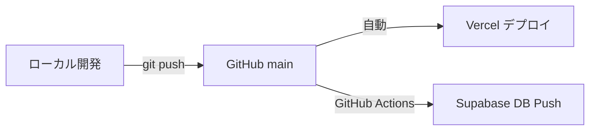

# デプロイ手順書

本プロジェクトのデプロイは **GitHub → Vercel（自動）+ Supabase（GitHub Actions）** の2経路で行われる。

---

## アーキテクチャ



## 接続情報

| サービス | 情報 |
|---|---|
| GitHub | `fumiya-antigravity/pmd-agent` |
| Vercel | GitHub連携済み（mainプッシュで自動デプロイ） |
| Supabase | プロジェクトID: `mfwgpicsalflypomhuly` |

---

## デプロイ手順

### 1. コード変更のデプロイ（Vercel）

Vercelは `main` ブランチへのプッシュで**自動デプロイ**される。

```bash
# 1. 変更をコミット
git add -A
git commit -m "feat: 変更内容の説明"

# 2. mainにプッシュ（= 自動デプロイ開始）
git push origin main
```

> **確認**: Vercelダッシュボードでデプロイ状況を確認
> https://vercel.com/dashboard

### 2. DBスキーマ変更のデプロイ（Supabase）

DBスキーマの変更は `supabase/migrations/` にSQLファイルを追加し、`main` にプッシュすることで **GitHub Actionsが自動実行** する。

#### 新しいマイグレーションの作成方法

```bash
# 1. マイグレーションファイルを作成
# ファイル名: YYYYMMDDHHMMSS_description.sql
touch supabase/migrations/20260216100000_add_example_column.sql

# 2. SQLを記述
# CREATE TABLE / ALTER TABLE など

# 3. コミット＋プッシュ
git add supabase/migrations/
git commit -m "feat: マイグレーション追加 — 変更内容"
git push origin main
# → GitHub Actions が自動で supabase db push を実行
```

#### 緊急時：手動でSQLを実行する場合

Management APIを使用:
```bash
python3 -c "
import json, urllib.request
sql = open('supabase/migrations/YOUR_FILE.sql').read()
url = 'https://api.supabase.com/v1/projects/mfwgpicsalflypomhuly/database/query'
req = urllib.request.Request(url,
    data=json.dumps({'query': sql}).encode('utf-8'),
    headers={
        'Content-Type': 'application/json',
        'Authorization': 'Bearer \$(grep SUPABASE_ACCESS_TOKEN .env | cut -d= -f2)',
        'User-Agent': 'Mozilla/5.0',
    }, method='POST')
with urllib.request.urlopen(req) as resp:
    print(resp.read().decode('utf-8'))
"
```

---

## 環境変数

### ローカル（`.env`）

| 変数 | 用途 |
|---|---|
| `OPENAI_API_KEY` | OpenAI API |
| `SUPABASE_URL` | Supabaseプロジェクト URL |
| `SUPABASE_ANON_KEY` | Supabase公開キー |
| `SUPABASE_SERVICE_ROLE_KEY` | Supabaseサービスロールキー |
| `SUPABASE_PROJECT_ID` | プロジェクトID |
| `SUPABASE_DB_PASSWORD` | DBパスワード |
| `SUPABASE_ACCESS_TOKEN` | アクセストークン |

### Vercel 環境変数

Vercelダッシュボード → Settings → Environment Variables で設定:
- `OPENAI_API_KEY`（必須 — Edge Functionsで使用）

### GitHub Secrets

リポジトリ Settings → Secrets and variables → Actions で設定:
- `SUPABASE_ACCESS_TOKEN`
- `SUPABASE_PROJECT_ID`
- `SUPABASE_DB_PASSWORD`

---

## トラブルシューティング

| 問題 | 対処 |
|---|---|
| Vercelデプロイ失敗 | Vercelダッシュボードでログ確認 |
| GitHub Actions失敗 | リポジトリのActionsタブでログ確認 |
| DB接続エラー | `.env`のSupabase情報確認。Supabaseダッシュボードでプロジェクト状態確認 |
| Management API 403 | `User-Agent`ヘッダーを設定して再試行 |

---

## ファイル構成

```
デプロイに関わるファイル:
├── .github/workflows/deploy-supabase.yml  # GitHub Actions
├── vercel.json                            # Vercel設定
├── package.json                           # 依存関係
├── api/                                   # Vercel Edge Functions
│   └── chat.js
├── supabase/
│   ├── config.toml                        # Supabase CLI設定
│   └── migrations/                        # DBマイグレーション
├── .env                                   # ローカル環境変数（gitignore済み）
└── .env.example                           # 環境変数テンプレート
```
