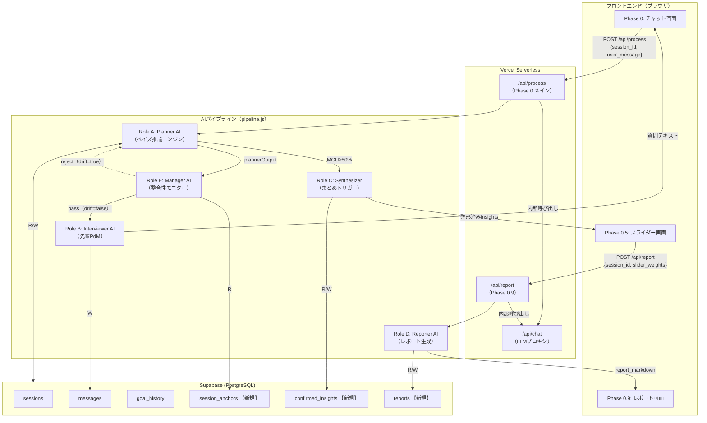
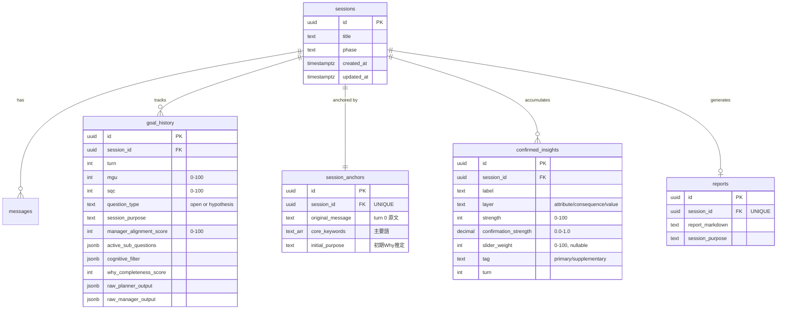

# 外部設計 — Why Discovery Engine（CLARIX）v3

**Version 3.0 | 2026-02-20**
**参照**: [PRD_requirements.md](file:///Users/fumiyatanaka/Google_Antigravity/pdm%20agent/PRD_requirements.md)

---

## 1. システム全体構成図



---

## 2. フェーズ別システム動作概要

| フェーズ | トリガー | 実行Role | DB書き込み | 応答時間上限 |
|---------|---------|----------|-----------|------------|
| Phase 0: 会話 | ユーザーテキスト送信 | A → E → B | messages, goal_history, confirmed_insights, session_anchors(初回) | < 10秒 |
| Phase 0.5: スライダー | MGU ≥ 80% | C | sessions.phase='SLIDER' | < 3秒 |
| Phase 0.9: レポート | スライダー値送信 | D | confirmed_insights.slider_weight, reports, sessions.phase='REPORT' | < 15秒 |

---

## 3. 画面設計

### 3.1 Phase 0: チャット画面

```
┌─────────────────────────────────────────┐
│  CLARIX — Why Discovery              [≡] │
├─────────────────────────────────────────┤
│                                         │
│  ┌─────────────────────────────────┐    │
│  │ 🤖 なんで作ろうと思ったの？      │    │
│  └─────────────────────────────────┘    │
│                                         │
│  ┌─────────────────────────────────┐    │
│  │ 👤 ドメイン知識がないと要件...   │    │
│  └─────────────────────────────────┘    │
│                                         │
│  ┌─────────────────────────────────┐    │
│  │ 🤖 つまり先輩たちがWhyを...      │    │
│  └─────────────────────────────────┘    │
│                                         │
│  ┌─ デバッグパネル（dev only） ─────┐  │
│  │ MGU: 65% | SQC: 72%              │  │
│  │ type: hypothesis | align: 87      │  │
│  └──────────────────────────────────┘  │
│                                         │
│  ┌────────────────────────┐ [送信↑]    │
│  │  ここに返答を入力...   │            │
│  └────────────────────────┘            │
└─────────────────────────────────────────┘
```

**画面仕様**:

| 要素 | 仕様 | 根拠（PRD参照） |
|------|------|----------------|
| AIメッセージ表示 | Role B の出力テキストのみ。Role A/E の JSON は一切非表示 | PRD §3.2 Role B「JSON・スコア・メタ情報の漏洩禁止」 |
| 入力形式 | 自由テキスト（改行可）。Enter=送信、Shift+Enter=改行 | PRD §3.1「テキストのみでやり取り（自由記述）」 |
| 送信中状態 | スピナー表示 + 入力フォーム無効化 + タイムアウト10秒で再送信ボタン | PRD §4 応答速度 < 10秒 |
| AIの初手メッセージ | Turn 0 では `"なんで作ろうと思ったの？"` 等のオープン型質問を自動生成 | PRD §1.2「大元の理解度: 0% → オープン型で問う」 |
| Phase遷移 | レスポンスの `phase === 'SLIDER'` で自動遷移 | PRD §3.1 フロー図 |
| デバッグパネル | 開発時のみ表示。MGU, SQC, question_type, alignment_score | — |

---

### 3.2 Phase 0.5: スライダー画面

```
┌─────────────────────────────────────────┐
│  CLARIX — レポートの強調設定        [≡] │
├─────────────────────────────────────────┤
│                                         │
│  会話を通じて見えてきた核心です。       │
│  重視したい観点を調整してください。     │
│                                         │
│  【主要観点】                           │
│  ❶ 先輩のHow要件定義がジュニアに       │
│     届いていない（結果層）              │
│     ●────────────────── 85%            │
│                                         │
│  ❷ 自分自身のWhyを言語化できて         │
│     いない（価値観層）                  │
│     ●──────────── 70%                  │
│                                         │
│  【補足観点】                           │
│  ❸ ツールより思考プロセスの再現が       │
│     必要（属性層）                      │
│     ●─────── 60%                       │
│                                         │
│  ────────────────────────────────────  │
│  [← 会話に戻る]   [レポートを生成 →]   │
└─────────────────────────────────────────┘
```

**画面仕様**:

| 要素 | 仕様 | 根拠（PRD参照） |
|------|------|----------------|
| スライダー初期値 | `strength` の値（Role C が設定） | PRD §3.2 Role C ルール4「スライダー初期値 = strength」 |
| スライダー範囲 | 0〜100 | PRD §3.2 Role D「slider_weight: 0〜100」 |
| 区分け | `strength ≥ 70` → 主要観点、`< 70` → 補足観点 | PRD §3.2 Role C ルール3 |
| 各項目の表示 | ラベル + ラダリング層名（属性/結果/価値観） | PRD §3.2 Role C「layer別に並び替え」 |
| ソート順 | 価値観層 > 結果層 > 属性層 | PRD §3.2 Role C ルール2 |
| 最大件数 | 5件 | PRD §3.2 Role C ルール5「最大5件（ミラーの法則）」 |
| 戻るボタン | `POST /api/process/resume` で sessions.phase='CONVERSATION' に戻す。※ MGUはリセットせず保持。次のユーザー発言でRole AがMGUを再計算し、会話が深まれば再びPhase 0.5に遷移 | PRD 「スライダーは会話完了後」 |
| 生成ボタン | 全スライダー値を POST /api/report → Phase 0.9 へ | — |

---

### 3.3 Phase 0.9: レポート画面

```
┌─────────────────────────────────────────┐
│  CLARIX — Why Discovery Report      [≡] │
├─────────────────────────────────────────┤
│  [← 最初からやり直す]  [↓ ダウンロード] │
│                                         │
│  # Why Discovery Report                 │
│                                         │
│  ## 1. セッションの要約                 │
│  (sessionPurpose をそのまま表示)        │
│                                         │
│  ## 2. 主要な課題・動機                 │
│  (strength≥70 & slider_weight高の       │
│   insightを詳述: 400-600字×weight比)   │
│                                         │
│  ## 3. 補足観点                         │
│  (strength<70: 100-200字×weight比)      │
│                                         │
│  ## 4. 発見の軌跡                       │
│  (属性→結果→価値観の3層で整理)          │
│                                         │
│  ## 5. 次のステップ提案                 │
│  (What定義への橋渡し)                   │
└─────────────────────────────────────────┘
```

**画面仕様**:

| 要素 | 仕様 | 根拠（PRD参照） |
|------|------|----------------|
| レポート構造 | 5セクション固定 | PRD §3.2 Role D「レポート出力構造」 |
| セクション文量 | `section_depth = base_depth × (slider_weight / 100)` | PRD §3.2 Role D「セクション文量の計算式」 |
| base_depth | 主要観点: 400-600字、補足観点: 100-200字 | PRD §3.2 Role D |
| レンダリング | Markdown → HTML 変換して表示 | — |
| ダウンロード | `.md` ファイルとしてローカル保存 | — |
| やり直し | セッション終了 → 新規セッション開始 | — |

---

## 4. API設計

### 共通仕様

| 項目 | 値 |
|------|-----|
| ベースURL | `/api/` |
| 認証 | なし（将来追加予定） |
| Content-Type | `application/json` |
| エラー形式 | `{ "error": "メッセージ", "code": "ERROR_CODE" }` |

---

### 4.1 `POST /api/chat`（既存・LLMプロキシ）

> すべてのRole（A/B/D/E）の LLM 呼び出しはここ経由。**変更不要**。

---

### 4.2 `POST /api/session`【新規】

> **役割**: 新規セッションを作成し session_id を返す。フロントエンド起動時 or 「やり直す」ボタン押下時に呼ばれる。

```json
// リクエスト: ボディなし
// レスポンス:
{ "session_id": "uuid", "phase": "WELCOME" }
```

サーバー側: `sessions` テーブルに `phase='WELCOME'` で INSERT し id を返す。

---

### 4.3 `POST /api/process`【新規】

> **役割**: Phase 0 のオーケストレーター。Role A → E → B パイプラインを実行。

#### リクエスト

```json
{
  "session_id": "uuid",
  "user_message": "ドメイン知識がないと要件定義を読み解けない人が多いと感じているから"
}
```

> `turn` はサーバー側で DB から算出（クライアントに持たせない）。

#### レスポンス（継続: MGU < 80%）

```json
{
  "phase": "CONVERSATION",
  "message": "つまり、先輩たちがWhyを省略したHowだけの要件定義を書いてて…",
  "turn": 3,
  "debug": {
    "mgu": 65,
    "sqc": 72,
    "question_type": "hypothesis",
    "session_purpose": "要件定義のWhyが若手に伝わっていない構造的問題を解決したい",
    "manager_alignment_score": 87,
    "active_sub_questions": ["要件定義を読み解けないとはどういう状況か"],
    "cognitive_filter": { "detected_how_what": ["Claude", "リポジトリ"] }
  }
}
```

#### レスポンス（完了: MGU ≥ 80%）

```json
{
  "phase": "SLIDER",
  "message": null,
  "turn": 5,
  "confirmed_insights": [
    {
      "id": "uuid",
      "label": "先輩のHow要件定義がジュニアに届いていない",
      "layer": "consequence",
      "strength": 85,
      "tag": "primary",
      "turn": 3
    },
    {
      "id": "uuid",
      "label": "自分自身のWhyを言語化できていない",
      "layer": "value",
      "strength": 70,
      "tag": "primary",
      "turn": 4
    }
  ],
  "debug": {
    "mgu": 82,
    "sqc": 88,
    "session_purpose": "..."
  }
}
```

#### サーバー側処理フロー（擬似コード）

```javascript
async function handleProcess(session_id, user_message) {
  // ── Phase ガード ──
  const session = await getSession(session_id);
  if (!session) return error(404, 'SESSION_NOT_FOUND');
  if (session.phase === 'SLIDER' || session.phase === 'REPORT')
    return error(400, 'PHASE_MISMATCH');

  // ── DB読み込み ──
  const latestGoal = await getLatestGoalHistory(session_id);
  const anchor = await getSessionAnchor(session_id);
  const history = await getMessages(session_id, { limit: 20 });
  const existingInsights = await getConfirmedInsights(session_id);
  const turn = history.filter(m => m.role === 'user').length;
  const prevInterviewerMsg = history.findLast(m => m.role === 'assistant')?.content ?? null;

  await saveMessage(session_id, 'user', user_message, { turn });

  // ── 初回ターン（turn 0）──
  if (turn === 0 && !anchor) {
    const plan = await callRoleA(session_id, user_message, null, null, []);
    // core_keywords: ユーザー発言の全キーワードを保持（What/Howも含む）
    // ※ What/Howは「なぜそれを行いたいのか」の思考のヒントとして重要
    // ※ Howの除外は最終レポート生成時（Role D）のみ。Whatはレポートに含めてOK
    const allKeywords = extractKeywords(user_message);
    await createSessionAnchor(session_id, {
      original_message: user_message,
      core_keywords: allKeywords,
      initial_purpose: plan.sessionPurpose
    });
    await saveGoalHistory(session_id, plan, { alignment_score: 100 }, turn);
    const question = await callRoleB(plan);
    await saveMessage(session_id, 'assistant', question, { turn: 0 });
    await updateSession(session_id, { phase: 'CONVERSATION' });
    return { phase: 'CONVERSATION', message: question, turn: 0, debug: buildDebug(plan, 100) };
  }

  // ── Role A（Planner）──
  // ※ Role A は「今回ターンで新たに確認された insight」のみ差分出力する
  //    累積は DB 側で管理
  const plan = await callRoleA(session_id, user_message, anchor, latestGoal, history);

  // ── Role E（Manager）── (初回は prevInterviewerMsg = null を許容)
  let mgr = await callRoleE(plan, anchor, prevInterviewerMsg);
  let retries = 0;
  while (mgr.drift_detected && retries < 2) {
    retries++;
    const corrected = await callRoleA(
      session_id, user_message, anchor, latestGoal, history, mgr.correction
    );
    mgr = await callRoleE(corrected, anchor, prevInterviewerMsg);
    Object.assign(plan, corrected);
  }
  // retries >= 2: drift無視で続行。goal_history.metadataに警告記録

  // ── DB保存 ──
  await saveGoalHistory(session_id, plan, mgr, turn);
  // confirmed_insights: 差分のみ。confirmation_strength ≥ 0.7 を upsert
  // upsert 条件: session_id + label が同一なら strength を更新
  for (const ins of plan.confirmed_insights ?? []) {
    if (ins.confirmation_strength >= 0.7) {
      await upsertConfirmedInsight(session_id, ins);
      // upsert: INSERT ON CONFLICT (session_id, label) DO UPDATE SET strength, turn
    }
    // confirmation_strength === 0（否定・訂正）:
    //   Role A が active_sub_questions に新しい派生質問を追加済み
    //   DB の confirmed_insights は変更しない（加算なし）
  }

  // ── 全派生質問の解消チェック ──
  const allResolved = plan.active_sub_questions.every(q => q.status === 'resolved');
  // allResolved = true の場合のみ MGU が更新される（PRDフロー図 Node H→I）

  // ── MGU ≥ 80% → Phase 0.5 ──
  if (plan.main_goal_understanding >= 80) {
    const allInsights = await getConfirmedInsights(session_id);
    // ガード: insights 0件なら Phase 0.5 に遷移しない
    if (allInsights.length === 0) {
      const q = await callRoleB(plan);
      await saveMessage(session_id, 'assistant', q, { turn });
      return { phase: 'CONVERSATION', message: q, turn, debug: buildDebug(plan, mgr.alignment_score) };
    }
    const synthesized = runRoleC(allInsights);
    await updateSession(session_id, { phase: 'SLIDER' });
    return { phase: 'SLIDER', message: null, turn, confirmed_insights: synthesized, debug: buildDebug(plan, mgr.alignment_score) };
  }

  // ── MGU < 80% → Role B ──
  const question = await callRoleB(plan);
  await saveMessage(session_id, 'assistant', question, { turn });
  return { phase: 'CONVERSATION', message: question, turn, debug: buildDebug(plan, mgr.alignment_score) };
}
```

---

### 4.4 `POST /api/process/resume`【新規】

> **役割**: Phase 0.5 から Phase 0 へ戻る。スライダーの「会話に戻る」ボタン用。

```json
// リクエスト: { "session_id": "uuid" }
// レスポンス: { "phase": "CONVERSATION" }
// サーバー: sessions.phase = 'CONVERSATION' に更新するのみ。
//   MGUはリセットしない。次のprocess呼び出しでRole Aが再計算する。
```

---

### 4.5 `POST /api/report`【新規】

> **役割**: スライダー値を受け取り、Role D でレポートを生成。

#### リクエスト

```json
{
  "session_id": "uuid",
  "slider_weights": [
    { "id": "uuid-1", "slider_weight": 90 },
    { "id": "uuid-2", "slider_weight": 70 },
    { "id": "uuid-3", "slider_weight": 30 }
  ]
}
```

#### レスポンス

```json
{
  "phase": "REPORT",
  "report_markdown": "# Why Discovery Report\n\n## 1. セッションの要約\n...",
  "session_purpose": "要件定義のWhyが若手に伝わっていない構造的問題を解決したい"
}
```

#### サーバー側処理フロー

```javascript
async function handleReport(session_id, slider_weights) {
  // 1. slider_weight を DB に反映
  for (const sw of slider_weights) {
    await updateInsightSliderWeight(sw.id, sw.slider_weight);
  }
  
  // 2. レポート生成に必要なデータを取得
  const insights = await getConfirmedInsights(session_id);  // slider_weight 付き
  const latestGoal = await getLatestGoalHistory(session_id);
  const allMessages = await getMessages(session_id, { limit: 100 });
  
  // 3. Role D（Reporter AI）呼び出し
  const report = await callRoleD(insights, latestGoal.session_purpose, allMessages);
  
  // 4. DB保存
  await createReport(session_id, report, latestGoal.session_purpose);
  await updateSession(session_id, { phase: 'REPORT' });
  
  return { phase: 'REPORT', report_markdown: report, session_purpose: latestGoal.session_purpose };
}
```

---

## 5. Role処理の詳細仕様

### 5.1 Role A: Planner AI — 入出力とアルゴリズム

#### プロンプト入力（`prompts/intent.js` が構築）

```
[system]
  あなたは Planner AI です。
  以下の JSON スキーマに従い出力してください。
  anchor（大元の問い）: {original_message}
  前回の状態: {latestGoal}  (初回は null)
  confirmed_insights（これまでに確認済み）: {insights}
  
[user]
  ユーザーの回答: {user_message}
  会話履歴（直近N件）: {history}
```

#### 出力スキーマ（JSON）

```json
{
  "main_goal_understanding": 65,
  "sub_question_clarity": 72,
  "why_completeness_score": 65,
  "sessionPurpose": "要件定義のWhyが若手に伝わっていない構造的問題を解決したい",
  "question_type": "hypothesis",
  "active_sub_questions": [
    {
      "question": "要件定義を読み解けないとはどういう状況か",
      "layer": "consequence",
      "status": "active"
    }
  ],
  "confirmed_insights": [
    {
      "label": "先輩のHow要件定義がジュニアに届いていない",
      "layer": "consequence",
      "strength": 85,
      "confirmation_strength": 0.7,
      "turn": 3
    }
  ],
  "cognitive_filter": {
    "detected_how": ["Claude", "リポジトリ"],
    "detected_what": ["壁打ちAI"],
    "instruction": "How語は会話中は思考のヒントとして活用。最終レポートでは除外。Whatはレポートに含めてOK。"
  },
  "next_question_focus": {
    "target_layer": "value",
    "focus": "なぜそのツールが必要だと感じたのか、根本動機"
  }
}
```

#### MGU 計算ロジック（実装すべきアルゴリズム）

```
// PRD §3.2 Role A「2軸スコアの計算定義」より

function calculateMGU(previousMGU, resolvedSubQuestion):
  layerScore = {
    "attribute":    5,    // 属性層（表面）
    "consequence": 10,    // 結果層（中間）
    "value":       20     // 価値観層（根本）
  }[resolvedSubQuestion.layer]

  confirmationStrength = classifyConfirmation(userResponse):
    "そうです" | "まさに"           → 1.0
    "大体あってます" | "そんな感じ"  → 0.7
    "少し" | "かもしれない"         → 0.3
    否定・訂正                      → 0.0 (加算なし、派生質問を再生成)

  delta = layerScore × confirmationStrength
  newMGU = min(previousMGU + delta, 100)
  
  // Role E チェック: delta > 30 は異常 → 再評価トリガー
  return newMGU
```

#### SQC 計算ロジック

> **SQCのLLMベース検出方針**:
> 曖昧語の検出は基本的にLLMに任せる。ただし、LLMの解釈精度を高めるために、
> **前提コンテキスト（anchor, MGU, sessionPurpose）をしっかり渡して方向性をコントロールすることが重要**。
> MGUが低い段階ではコンテキストが浅く精度が低いが、MGUが高まるほどコンテキストが深くなり精度向上。

```
// SQCは Role A が LLM で算出する（ルールベースではない）
// Role A のプロンプトに以下を埋め込む:

SQC算出指示:
  ユーザーの回答中の「曖昧語」を検出し、SQCスコアを 0〜100 で出力せよ。
  曖昧語の例:
    - 代名詞（「それ」「あれ」「これ」）
    - 抽象名詞（「もの」「こと」「感じ」）
    - 文脈上未定義の固有概念
  判定基準: SQC = 100 - (曖昧語数 / 総語数 × 100)

MGU連動のコンテキスト制御:
  MGU < 60%:
    → anchor.original_message のみを前提として渡す（コンテキスト薄）
    → LLMの解釈余地が広く、オープンな検出
  MGU ≥ 60%:
    → anchor + sessionPurpose + confirmed_insights を前提として渡す
    → LLMが「この文脈で何が曖昧か」を精度高く判定

SQC ≥ 80:
  → 当該派生質問を「解消済み」としてフラグ（status: 'resolved'）
```

#### question_type 判定

```
// PRD §3.2 Role A「質問タイプ判定ロジック」より

if MGU < 60:
  question_type = "open"
  // 根拠: Schank & Abelson スクリプト理論
  // → 仮説を立てる文脈が不十分

elif 60 <= MGU < 80:
  question_type = "hypothesis"
  // 根拠: Festinger (1954) 閾値反応
  // → 確信度が十分、解釈を提示して確認

elif MGU >= 80:
  // Phase 0.5 へ移行
  // 根拠: Simon (1956) 限定合理性
```

---

### 5.2 Role B: Interviewer AI — 入出力とルール

#### プロンプト入力（`prompts/interviewer.js` が構築）

```
[system]
  あなたは先輩PdMです。後輩の壁打ち相手として自然な1文の質問を生成してください。
  
  ## あなたの性格
  - 率直・シンプル・知的な対等さ
  - 一緒に答えを見つけている感覚
  
  ## 現在の状態
  sessionPurpose: {plannerOutput.sessionPurpose}
  question_type: {plannerOutput.question_type}
  focus: {plannerOutput.next_question_focus}
  active_sub_questions: {plannerOutput.active_sub_questions}
  
  ## 禁止事項
  - JSON, スコア, メタ情報の漏洩は絶対禁止
  - How語の質問への混入禁止: {plannerOutput.cognitive_filter.detected_how}
    （※ What語は思考のヒントとして会話中は使用OK）
  - 禁止語: 苦痛, 感じる, つらい, 悩み, 大変, つまずく
  - 1ターンに2つ以上の質問は禁止
  
  ## 推奨語
  ボトルネック, 構造, 文脈, 意思決定, 前提, 乖離
  
  ## 質問スタイル
  {question_type に応じた生成ルール — 下記参照}

[user]
  （なし — Role B は system prompt のみで質問を生成）
```

#### question_type 別のプロンプト

```
■ question_type = "open"（MGU 0-59%）:
  文頭: 「なんで」「どういう意味で」「具体的にどういう状況？」
  文末: 「？」のみ
  トーン: 率直・シンプル・一文
  禁止: 選択肢の提示、解釈の混入
  OK例: 「なんで作ろうと思ったの？」
  NG例: 「技術的なボトルネックですか、それとも組織の問題が大きいですか？」

■ question_type = "hypothesis"（MGU 60-79%）:
  文頭: 「つまり〇〇ってこと？」「こういうことをイメージしてる？」
  文末: 「〜かな？」「〜ってこと？」（断言禁止）
  分量: 1-2文以内
  OK例: 「つまり、先輩がWhyを省略したHowだけの要件定義を書いてて、
         ジュニアにとって意味やコンテキストが伝わらない文書になってる、ってこと？」
  NG例: 「なるほど、それはとても大変でしたね。」（感情語禁止）
```

#### 出力

```
jsonMode = false（自由テキスト出力）
出力例: "つまり、先輩たちがWhyを省略したHowだけの要件定義を書いてて、ジュニアにとって意味やコンテキストが伝わらない文書になってる、ってこと？"
```

---

### 5.3 Role C: Completion Synthesizer — アルゴリズム

> **LLM不使用**。ロジックのみで実装可能。

```javascript
function runRoleC(allInsights) {
  // PRD §3.2 Role C「confirmed_insights 整形ルール」より
  
  // ルール1: 同一テーマを strength の加重平均で集約
  const grouped = groupByTheme(allInsights);
  const merged = grouped.map(group => ({
    ...group[0],
    strength: weightedAverage(group.map(i => i.strength))
  }));
  
  // ルール2: layer別に並び替え（価値観 > 結果 > 属性）
  const layerOrder = { value: 0, consequence: 1, attribute: 2 };
  merged.sort((a, b) => layerOrder[a.layer] - layerOrder[b.layer]);
  
  // ルール3: strength ≥ 70 → primary, < 70 → supplementary
  merged.forEach(i => {
    i.tag = i.strength >= 70 ? 'primary' : 'supplementary';
  });
  
  // ルール3.5: ジョハリの窓—「ユーザーが自覚していなかったinsight」に特別フラグ
  // 判定: 初回のuser_messageに含まれないキーワードを含むinsight
  // → johari_blind_spot = true
  
  // ルール4: スライダー初期値 = strength（そのまま）
  // （フロントエンドで strength を初期値として使用）
  
  // ルール5: 最大5件
  return merged.slice(0, 5);
}
```

---

### 5.4 Role D: Reporter AI — 入出力

#### プロンプト入力

```
[system]
  あなたは Reporter AI です。以下のデータから Why Discovery Report を生成してください。
  
  ## レポート構造（5セクション固定）
  1. セッションの要約 — sessionPurpose をそのまま使用
  2. 主要な課題・動機 — tag="primary" の insights を詳述
  3. 補足観点 — tag="supplementary" の insights を簡潔に
  4. 発見の軌跡 — 属性→結果→価値観のラダリング順で整理
  5. 次のステップ提案 — What定義への橋渡し
  
  ## 文量計算ルール
  section_depth = base_depth × (slider_weight / 100)
  base_depth: 主要観点=400-600字、補足観点=100-200字
  
  ## 出力形式
  Markdown（# 見出し付き）

[user]
  sessionPurpose: {session_purpose}
  confirmed_insights: {insights（slider_weight付き）}
  全会話ログ: {allMessages}
```

#### 出力

```
Markdown テキスト（レポート全文）
jsonMode = false で呼び出し
```

---

### 5.5 Role E: Manager AI — チェックロジック

#### 入力

```json
{
  "plannerOutput": { "sessionPurpose": "...", "mgu": 65, ... },
  "anchor": { "original_message": "...", "core_keywords": [...], "initial_purpose": "..." },
  "previousInterviewerQuestion": "..."  // null 許容（turn 0 の場合）
}
```

#### チェック項目と閾値

```
// PRD §3.2 Role E「監視対象・逸脱判定ルール」より

■ Role A チェック:
  [CHECK-A1] sessionPurpose ↔ anchor.original_message のコサイン類似度
    閾値: < 0.7 → drift_detected = true
    
  [CHECK-A2] active_sub_questions ↔ sessionPurpose の関連性
    各 sub_question が sessionPurpose のキーワードを含むか
    全て無関連 → sub_question_drift = true
    
  [CHECK-A3] MGU の急上昇チェック
    delta > 30（1ターンで+30以上） → mgu_spike 違反

■ Role B チェック（前回のInterviewer出力に対して実行）:
  [CHECK-B1] How語の混入（What語は会話中OK）
    cognitive_filter.detected_how の語が質問文に含まれる → cognitive_filter_violation
    
  [CHECK-B2] 複数質問の検出
    質問文中の「？」が2個以上 → miller_law_violation
    
  [CHECK-B3] 感情語の混入
    禁止語リスト（苦痛/感じる/つらい/悩み/大変/つまずく）の検出 → character_violation

■ 会話全体チェック:
  [CHECK-G1] 直近3ターンのトピック逸脱
    直近3ターンの user message + assistant message が anchor.core_keywords と無関連 → topic_drift
```

#### 出力スキーマ

```json
{
  "alignment_score": 87,
  "drift_detected": false,
  "violations": [],
  "correction": null
}
```

#### 逸脱時の修正指示

```json
{
  "alignment_score": 43,
  "drift_detected": true,
  "violations": ["sessionPurpose_drift", "sub_question_off_topic"],
  "correction": {
    "target_role": "Planner",
    "instruction": "現在の sessionPurpose が元の問いから外れています。active_sub_questions を元メッセージのコアワードに再紐付けしてください。",
    "anchor_message": "（anchor.original_message をそのまま挿入）"
  }
}
```

#### 差し戻しフロー

```
drift_detected = true の場合:
  retry_count += 1
  if retry_count <= 2:
    plannerOutput.correction = managerOutput.correction を追加して Role A 再呼び出し
  else:
    drift を無視して Role B へ進む（UXを止めない）
    警告ログを DB に記録（goal_history.metadata に記録）
```

---

## 6. DBスキーマ設計

### 6.1 既存テーブル変更

#### `sessions`

```sql
-- phase の ENUM を新設計に更新
ALTER TABLE sessions DROP CONSTRAINT IF EXISTS sessions_phase_check;
ALTER TABLE sessions ADD CONSTRAINT sessions_phase_check
  CHECK (phase IN (
    'WELCOME',         -- セッション作成直後
    'CONVERSATION',    -- Phase 0: 会話中（旧 WHY_SESSION を統合）
    'SLIDER',          -- Phase 0.5: スライダー設定中
    'REPORT',          -- Phase 0.9: レポート生成済み
    'COMPLETE'         -- 完了
  ));
```

#### `goal_history`

```sql
ALTER TABLE goal_history
  ADD COLUMN IF NOT EXISTS mgu INTEGER DEFAULT 0
    CHECK (mgu >= 0 AND mgu <= 100),
  ADD COLUMN IF NOT EXISTS sqc INTEGER DEFAULT 0
    CHECK (sqc >= 0 AND sqc <= 100),
  ADD COLUMN IF NOT EXISTS question_type TEXT DEFAULT 'open'
    CHECK (question_type IN ('open', 'hypothesis')),
  ADD COLUMN IF NOT EXISTS session_purpose TEXT DEFAULT '',
  ADD COLUMN IF NOT EXISTS manager_alignment_score INTEGER DEFAULT 100,
  ADD COLUMN IF NOT EXISTS active_sub_questions JSONB DEFAULT '[]',
  ADD COLUMN IF NOT EXISTS turn INTEGER DEFAULT 0,
  ADD COLUMN IF NOT EXISTS raw_planner_output JSONB DEFAULT NULL,
  ADD COLUMN IF NOT EXISTS raw_manager_output JSONB DEFAULT NULL;
```

### 6.2 新規テーブル

#### `session_anchors`

```sql
CREATE TABLE IF NOT EXISTS session_anchors (
  id                UUID PRIMARY KEY DEFAULT gen_random_uuid(),
  session_id        UUID NOT NULL REFERENCES sessions(id) ON DELETE CASCADE,
  original_message  TEXT NOT NULL,
  core_keywords     TEXT[] DEFAULT '{}',
  initial_purpose   TEXT DEFAULT '',
  created_at        TIMESTAMPTZ NOT NULL DEFAULT NOW()
);
CREATE UNIQUE INDEX idx_session_anchors_session ON session_anchors (session_id);
```

#### `confirmed_insights`

```sql
CREATE TABLE IF NOT EXISTS confirmed_insights (
  id                UUID PRIMARY KEY DEFAULT gen_random_uuid(),
  session_id        UUID NOT NULL REFERENCES sessions(id) ON DELETE CASCADE,
  label             TEXT NOT NULL,
  layer             TEXT NOT NULL CHECK (layer IN ('attribute', 'consequence', 'value')),
  strength          INTEGER NOT NULL DEFAULT 50 CHECK (strength >= 0 AND strength <= 100),
  confirmation_strength DECIMAL(3,1) DEFAULT NULL,
  slider_weight     INTEGER DEFAULT NULL,
  tag               TEXT DEFAULT 'supplementary' CHECK (tag IN ('primary', 'supplementary')),
  turn              INTEGER NOT NULL DEFAULT 0,
  created_at        TIMESTAMPTZ NOT NULL DEFAULT NOW()
);
CREATE INDEX idx_insights_session ON confirmed_insights (session_id, strength DESC);
-- upsert用: 同一session_id + labelはstrengthを更新
CREATE UNIQUE INDEX idx_insights_upsert ON confirmed_insights (session_id, label);
```

> `confirmation_strength` カラムを追加（PRD §3.2「confirmation_strength ≥ 0.7 の肯定が得られた仮説を記録」への対応）。

#### `reports`

```sql
CREATE TABLE IF NOT EXISTS reports (
  id                UUID PRIMARY KEY DEFAULT gen_random_uuid(),
  session_id        UUID NOT NULL REFERENCES sessions(id) ON DELETE CASCADE,
  report_markdown   TEXT NOT NULL,
  session_purpose   TEXT DEFAULT '',
  created_at        TIMESTAMPTZ NOT NULL DEFAULT NOW()
);
CREATE UNIQUE INDEX idx_reports_session ON reports (session_id);
```

### 6.3 ER図



---

## 7. セッション復元設計

> PRD §4「状態復元: セッション再開時に前回状態を完全復元（MGU・SQC・confirmed_insights・anchorを含む）」

#### 復元手順（フロントエンド起動時）

```javascript
async function restoreSession(session_id) {
  const session = await getSession(session_id);
  
  switch (session.phase) {
    case 'WELCOME':
      // 初期状態→チャット画面を空で表示、入力待ち
      renderChatUI([], null);
      break;

    case 'CONVERSATION':
      const messages = await getMessages(session_id);
      const latestGoal = await getLatestGoalHistory(session_id);
      renderChatUI(messages, latestGoal);
      break;
      
    case 'SLIDER':
      const insights = await getConfirmedInsights(session_id);
      renderSliderUI(runRoleC(insights));
      break;
      
    case 'REPORT':
    case 'COMPLETE':
      const report = await getReport(session_id);
      renderReportUI(report);
      break;
  }
}
```

---

## 8. 仮説品質基準の設計反映

> PRD §3.3 の3基準を Role A のプロンプトに埋め込む。

| 基準 | プロンプトへの反映 | バリデーション |
|------|-----------------|---------------|
| ① 統計的独立性（直交） | 「前回の仮説と同じ軸の質問は禁止」 | Role E: CHECK-A2 で active_sub_questions の重複を検出 |
| ② ラダリング3層カバー | 「属性/結果/価値観の各層から最侎1件」 | confirmed_insights の layer 分布を Role E が監視 |
| ③ ドメイン特化 | 「ユーザー語彙からドメイン推定、同じ言語で仮説生成」 | Role B がドメイン語彙適応 |

**派生質問の上限**: 最大ターン数 = 10（PRD「5 Whys」×2層を想定）。超過時は MGU を 80% に強制設定し Phase 0.5 へ遷移。

---

## 9. KPI計測設計

> PRD §2.2 のKPIを外部設計に落とし込む。

| KPI | 計測方法 | データソース |
|-----|---------|------------|
| Why Discovery Rate（≥ 70%） | sessions のうち `phase = 'REPORT'` or `'COMPLETE'` に到達した割合 | `sessions.phase` |
| Turn to Completion（3-5ターン） | `goal_history` で MGU ≥ 80% に達した最初のレコードの `turn` | `goal_history.turn + goal_history.mgu` |
| Hypothesis Accuracy（≥ 40%） | `confirmed_insights` のうち `confirmation_strength >= 0.8` の割合 | `confirmed_insights.confirmation_strength` |
| Return Rate（≥ 30%） | 同一ブラウザから複数セッションを開始した割合 | `sessions.metadata` にブラウザID保存（将来） |

---

## 10. 非機能要件の設計反映

| 項目 | 設計上の対応 |
|------|------------|
| Phase 0 < 10秒 | `api/chat.js` の maxDuration: 60s。Role A + E + B の3回 LLM 呼び出し。Role E をルールベースにすれば2回に削減可能 |
| Phase 0.5 < 3秒 | Role C は LLM 不使用（JavaScript ロジックのみ） |
| Phase 0.9 < 15秒 | Role D は maxTokens: 4000 で呼び出し |
| Manager 実行コスト | Phase A: まず LLM で実装（gpt-4o-mini）。パフォーマンス問題があればルールベースに移行 |
| モデル非依存 | `callAPI()` で model パラメータを Role ごとに設定可能にする（現状は固定 `gpt-4o-mini`） |
| 情報損失ゼロ | 全ての中間出力（plannerOutput, managerOutput）を goal_history に JSONB で保存 |
| セッション復元 | §7 に定義済み |

---

## 11. エラーハンドリング設計

| エラー種別 | 発生箇所 | HTTPステータス | エラーコード | UX |
|-----------|---------|-------------|-------------|-----|
| OpenAI タイムアウト | `callAPI()` | 504 | `AI_TIMEOUT` | 再送信ボタン表示 |
| OpenAI エラー | `callAPI()` | 502 | `AI_ERROR` | 再送信ボタン表示 |
| Role A JSON パース失敗 | `pipeline.js` | — | — | 内部リトライ1回。失敗したら 500 `PLANNER_PARSE_ERROR` |
| Manager 差し戻し上限超過 | `pipeline.js` | — | — | drift を無視して続行。ログのみ記録 |
| DB 書き込みエラー | `supabase-client.js` | 500 | `DB_ERROR` | 「データ保存に失敗しました」 |
| セッション未存在 | `/api/process` | 404 | `SESSION_NOT_FOUND` | 新規セッション開始を促す |
| Phase不整合（SLIDER中にprocess呼び出し） | `/api/process` | 400 | `PHASE_MISMATCH` | 「現在のフェーズではこの操作はできません」 |

---

## 12. 既存実装との差分まとめ

| カテゴリ | ファイル | 対応 | 内容 |
|---------|---------|------|------|
| ✅ 継続 | `api/chat.js` | 変更なし | LLMプロキシ |
| ✅ 継続 | `supabase-client.js` | 関数追加 | 新テーブル用CRUD追加 |
| ⚠️ 修正 | `src/ai/prompts/intent.js` | 大幅修正 | MGU/SQC計算・confirmed_insights蓄積・anchor入力・ラダリング層分類 |
| ⚠️ 修正 | `src/ai/prompts/interviewer.js` | 全面書き直し | 先輩PdMキャラクター・MGU段階別質問・禁止語/推奨語 |
| ⚠️ 修正 | `src/ai/crews/pipeline.js` | 大幅修正 | Phase遷移・Role E挿入・差し戻しループ・初回anchor作成 |
| 🆕 新規 | `src/ai/prompts/synthesizer.js` | 新規 | Role C ロジック（LLM不使用） |
| 🆕 新規 | `src/ai/prompts/reporter.js` | 新規 | Role D プロンプト |
| 🆕 新規 | `src/ai/prompts/manager.js` | 新規 | Role E プロンプト |
| 🆕 新規 | `src/ai/crews/reporter.js` | 新規 | Role D Crew |
| 🆕 新規 | `src/ai/crews/manager.js` | 新規 | Role E Crew |
| 🆕 新規 | `api/process.js` | 新規 | Phase 0 エンドポイント |
| 🆕 新規 | `api/report.js` | 新規 | Phase 0.9 エンドポイント |
| 🗑️ 廃止 | `parseSliderAnswer()` | 削除 | 旧会話中スライダー |
| 🗑️ 廃止 | `renderCompletionCard()` | 削除 | 旧まとめカードUI |
| 🗑️ 廃止 | `buildPhase0FeedbackResult()` | 削除 | 旧UI互換レスポンス構築（新API設計で代替） |
